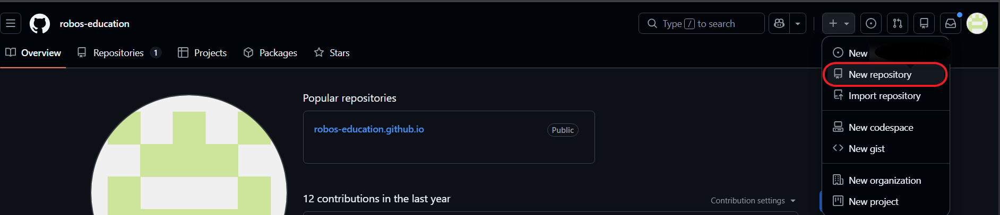

# 📚 Chapter 2. GitHub와 Web Blog 시작하기(GitHub, Markdown과 MkDocs)

Chapter 1에서 작성한 HTML을 Web에 배포하는 과정을 알아본다.(github.com을 사용)  
GitHub에 대하여 알아보고, 자신의 Web Blog를 만들기 위한 설정을 알아본다.

---

## 📖 1. GitHub.com

GitHub는 Code를 Cloud에 저장하고 관리하는 Platform으로 크게 세 가지 역할을 한다.

### 📄 ① 저장소 (Repository)
코드와 파일을 Cloud에 저장하는 공간  

```
내 컴퓨터 (local)  ── push ──▶  GitHub (remote)
                 ◀── pull ──
```

### 📄 ② 버전 관리 (Version Control)
파일을 수정할 때마다 **이전 상태를 기억**시킬 수 있다. 
따라서 언제든지 과거의 상태로 돌아갈 수 있다.

- Commit: 버전 관리의 기본 단위로 파일을 수정하고 저장할 때마다 누가, 언제, 어떤 내용을 변경했는지 기록을 남길 수 있다.  
이를 통해 우리는 과거 지점으로 code를 되돌릴 수 있고, 어떤 과정으로 수정되어 왔는지 추적할 수 있다.
- Branch: 기존의 코드 작성에서 가지를 쳐서 독립적인 공간을 만드는 기능  
새로운 수정을 서비스되고 있는 code에 영향을 주지 않고 적용시켜 Test 할 수 있다.  
여러 개발자가 동시에 각기 다른 수정을 병렬 작업으로 시행할 수 있다.  
- Pull Request & Merge: 개별 Branch에서 Test가 끝난 Code를 Main Code에 합치는 과정  

### 📄 ③ 협업 (Collaboration)
Repository에 저장된 내용을 공개·비공개로 설정할 수 있으며,
공개 설정 시 인터넷이 되는 곳이라면 어디서든 누구나 참여하여 협업할 수 있다.

---

## 📖 2. GitHub Pages — 무료 웹 호스팅

GitHub의 **GitHub Pages**기능을 이용하면 개인의 Web Site를 구성할 수 있다.
Repository에 올린 파일을 자동으로 웹사이트를 만들어 주는 Hosting Service다.

```
내 컴퓨터                         GitHub                     인터넷
calculator.html  ── push ──▶  repository  ──▶  https://내아이디.github.io/calculator
```

---

## 📖 3. GitHub 가입, Repository 생성, Web Page Deploy

GitHub에 가입하고, 파일을 올리고, 실제 URL로 접근한다.
지난 Chapter에서 작성한 01_calcu_03.html을 배포한다.

---

### 📄 1. GitHub 가입

[github.com](https://github.com)

1. **Sign up** 클릭
2. 이메일 주소 입력
3. 비밀번호 설정
4. username 입력 (영문, 숫자, 하이픈만 사용 가능)
5. 이메일 인증 완료

> username은 로그인 계정으로 사용할 수 있고, 나중에 변경할 수 있다.  
> 하지만 접속 URL과 Web Site의 URL로 사용되기 때문에 신중하게 생성해야 한다.  
> github.com 접속 page 오른쪽 상단 프로필 클릭 → Settings → 왼쪽 메뉴의 Account → Change username 클릭
> **username은 URL에 그대로 사용된다.**  
> 예: username이 `robos-education`이면 내 GitHub Pages 주소는 `https://robos-education.github.io` 가 된다.

---

### 📄 2. Repository 생성

가입 후 로그인 상태에서 진행한다.

1. 오른쪽 위 **+** 버튼 → **New repository** 클릭
2. 아래 항목을 입력한다

   - Repository name: `calculator`
   - Description: (선택) 간단한 설명 입력
   - choose visibility: Public / Private: **Public** 선택
   - Add a README file: 체크 **안 함**

3. **Create repository** 클릭

Repository가 생성되면 파일이 없는 빈 상태의 페이지가 나타난다.  

 

---

### 📄 3. 파일 업로드 (GitHub 웹에서 직접)

Repository 화면에서 직접 파일을 올린다.

1. **uploading an existing file** 링크 클릭  
   (또는 **Add file** → **Upload files**)
2. `01_calcu_03.html` 파일을 드래그하거나 **choose your files**로 선택
3. 파일이 목록에 나타나면 아래로 스크롤
4. **Commit changes** 버튼 클릭

파일이 **저장소(Repository)**에 추가된다.  

 

---

### 📄 4. GitHub Pages 설정

Repository에 올린 HTML 파일을 웹 페이지로 공개한다.

1. Repository 상단 탭에서 **Settings** 클릭
2. 왼쪽 사이드바에서 **Pages** 클릭
3. **Source** 항목에서 **Deploy from a branch** 선택
4. Branch를 **main**, 폴더를 **/ (root)** 로 설정
5. **Save** 클릭

저장 후 페이지를 새로고침하면 상단에 URL이 표시된다.  

   

```
Your site is live at https://<username>.github.io/calculator/<파일명>.html
```

> URL이 나타나기까지 1~2분 정도 걸릴 수 있다.
> 페이지가 열리지 않는다면 상단 Actions 탭에서 현재 배포한 Workflow가 초록색으로 바뀌었는지 확인한다.
---

### 📄 5. Web Browser에서 확인

표시된 URL을 복사해서 브라우저 주소창에 붙여넣는다.

`01_calcu_03.html`이 나타나면 배포가 완료된다.

URL 구조는 다음과 같다.

```
https://<username>.github.io/<repository-name>/01_calcu_03.html
```

---
### 📄 6. index.html과 URL

GitHub Pages는 폴더 URL로 접근할 때 `index.html`을 자동으로 찾아서 열어준다.
만일 `index.html`이 있으면 URL에서 파일 이름을 생략할 수 있다.

| 파일 이름 | 접근 URL |
|-----------|----------|
| `01_calcu_03.html` | `https://<username>.github.io/calculator/01_calcu_03.html` |
| `index.html` | `https://<username>.github.io/calculator/` |

---

### 📄 index.html 만들기

1. Repository code 화면에서 **Add file** → **Create new file** 클릭
2. 파일 이름 입력란에 `index.html` 입력
3. 아래 코드를 입력한다

```html
<!DOCTYPE html>
<html lang="ko">
<head>
  <meta charset="UTF-8">
  <title>홍길동의 페이지</title>
</head>
<body>
  <h1>안녕하세요, 홍길동입니다.</h1>
  <p><a href="01_calcu_03.html">계산기 바로가기</a></p>
</body>
</html>
```
4. 아래로 스크롤 → **Commit changes** 클릭

Commit이 완료되면 아래 URL로 접근할 수 있다.
```
https://<username>.github.io/calculator/
```

---

## ✅ 4. 정리

- GitHub: 코드 저장소 + 버전 관리 + 협업 도구
- GitHub Pages: 내 파일을 무료 웹사이트로 만들어 주는 기능  

    | 단계 | 내용 |
    |------|------|
    | GitHub 가입 | 이메일로 계정 생성, username 설정 |
    | Repository 생성 | Public, 이름은 `calculator` |
    | 파일 업로드 | 웹 화면에서 `01_calcu_03.html` 업로드 |
    | GitHub Pages 설정 | Settings → Pages → main branch |
    | 확인 | `https://<username>.github.io/calculator/01_calcu_03.html` |
    | index 설정 | index.html 생성 `https://<username>.github.io/calculator/` |  
    
---
