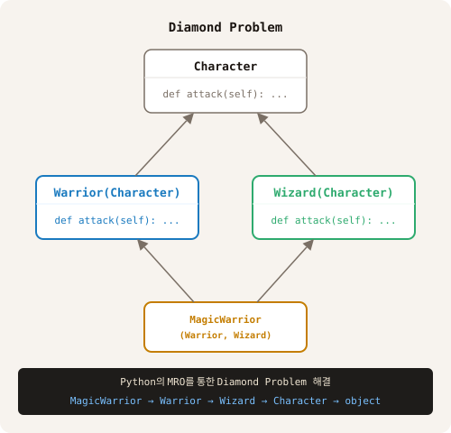

# Chapter 1. Inheritance Advanced
---

> **소재:** 게임 캐릭터 직업 시스템  
> **핵심 질문:** "전사, 마법사, 궁수를 따로따로 만들면 코드가 어떻게 될까?"

## Single Inheritance와 `super()`

### 왜 필요한가?

- `super()`를 사용하지 않는 상속

```python
# 게임에서 전사, 궁수, 마법사, 혹은 두 특징을 갖는 Character가 필요하다.

class Character:
    def __init__(self, name, hp):
        self.name = name
        self.hp = hp

class Warrior(Character):
    def __init__(self, name, hp, armor):
        Character.__init__(self, name, hp)  # 부모 클래스 직접 호출
        self.armor = armor

class MagicWarrior(Warrior):
    def __init__(self, name, hp, armor, mana):
        Warrior.__init__(self, name, hp, armor)  # 또 직접 호출
        self.mana = mana
```
---
### 문제점: 
- 만일 parents class의 이름이 바뀐다면 child class의 내부 코드가 모두 바뀌어야 한다.  

---

### 그래서:
 - `super()`를 사용하는 상속

```python
class Character:
    def __init__(self, name, hp):
        self.name = name
        self.hp = hp

    def attack(self):
        print(f"{self.name} basic attack!")

class Warrior(Character):
    def __init__(self, name, hp, armor):
        super().__init__(name, hp)
        self.armor = armor

    def attack(self):
        super().attack()               # 부모 attack() 먼저 실행
        print(f"{self.name} Sword Slash!")

arthur = Warrior("Arthur", 200, 50)
arthur.attack()
print(Warrior.__mro__) # Warrior.mro() mro는 class method이기 때문에 class에서 호출해야 한다.
# Arthur basic attack!
# Arthur Sword Slash!
# (<class '__main__.Warrior'>, <class '__main__.Character'>, <class 'object'>)
```
### 설명:

- `Character.__init__(self, ...)` → 클래스를 직접 지정하여 위험하다.
- `super().__init__(...)` → MRO 순서대로 작동하여 안전하다.
- 위 두 코드는 같아 보이지만 다중 상속에서 다르게 작동한다.

---

> **Method Resolution Order (MRO) 란 무엇인가?**  
> 같은 이름의 method가 여러 class에 있을 때 찾아가는 순서(메서드 결정 순서)

---

## Multiple Inheritance

그러나 다중 상속에서의 super()는 혼란스러운 문제을 발생시킨다.  

전사이면서 마법도 사용하는 캐릭터를 만들고 싶다면?  
Warrior와 Wizard를 따로 만들었으니 둘 다 상속받으면 되지 않을까?

```python
class Character:
    def __init__(self, name, hp):
        self.name = name
        self.hp = hp

class Warrior(Character):
    def __init__(self, name, hp, armor):
        super().__init__(name, hp)
        self.armor = armor

    def attack(self):
        print(f"{self.name} Sword Slash!")

class Wizard(Character):
    def __init__(self, name, hp, mana):
        super().__init__(name, hp)
        self.mana = mana

    def attack(self):
        print(f"{self.name} Fireball!")

# 둘 다 상속
class MagicWarrior(Warrior, Wizard):
    pass

hero = MagicWarrior("Park", 100, 50, 200)  # 오류 발생
# TypeError: Warrior.__init__() takes 4 positional arguments but 5 were given
```

---

### 문제점 1: `__init__()`의 parameter 충돌

MRO의 첫 번째 순서인 Warrior의 `__init__()`가 호출될 때 parameter 오류가 발생한다.

- Warrior의 parameter: `self, name, hp, armor`
- 호출한 parameter: `self, name, hp, armor, mana`

그럼 MagicWarrior에 생성자를 만들어 직접 초기화하면 해결될까?

```python
class MagicWarrior(Warrior, Wizard):
    def __init__(self, name, hp, armor, mana):
        Warrior.__init__(self, name, hp, armor)  # 직접 호출
        Wizard.__init__(self, name, hp, mana)    # 직접 호출
        print(f"MagicWarrior __init__ Done!")

hero = MagicWarrior("Park", 100, 50, 200)  # 여전히 오류 발생
```

생성자의 첫 번째 줄 `Warrior.__init__(self, name, hp, armor)`가 호출될 때:

- Warrior class의 생성자 안에 있는 `super()`가 MRO 때문에 Wizard가 된다.(mana parameter가 있어야 한다.)
- 그러나 Warrior의 생성자 안에 있는 `super()`는 Character로 설계되어 있다.(mana parameter가 없다.)
- 따라서 `mana` parameter를 전달할 수가 없다. 
- Python의 MRO 때문에 다중 상속에서 `super()`를 사용하면 생성자의 parameter 오류가 복잡해진다.

---

### 문제점 2: `Character.__init__` 이중 호출

- `Character.__init__()`가 Warrior에 의해서 호출
- `Character.__init__()`가 Wizard에 의해서 다시 호출
- 위 code 처럼 단순 초기화가 아니고 두 번 실행되면 안 되는 상황이면 (로그인 같은 경우) 심각한 버그로 이어질 수 있다.

---

## Mixin Pattern

### 왜 필요한가?

위에서 본 두 가지 문제를 해결하기 위하여

구조 자체를 바꿔서 해결한다.  
method만 가진 class를 따로 분리한다.

- 별도의 `__init__()`가 필요없기 때문에 충돌을 피할 수 있다.

```python
# Character의 공통 사항 parents class
class Character:
    def __init__(self, name, hp):
        self.name = name
        self.hp = hp

# 상속할 하위 Character class의 method들을 class 내부에 두는 것이 아니고
# 기능 class를 별도로 만들어 필요한 Character class에서 따로 상속한다.
# 기능 class는 __init__()가 필요 없어 super()의 혼란과 MRO의 혼란을 피할 수 있다.

class SwordMixin:   # 칼 휘두르기
    def sword_attack(self):
        print(f"{self.name} Sword Slash! {self.hp * 0.5} damage")

class FireMixin:    # 불 마법
    def fire_attack(self):
        print(f"{self.name} Fireball! {self.hp * 0.8} damage")

class SwimMixin:    # 헤엄치기
    def swim(self):
        print(f"{self.name} is swimming!")

# 필요한 기능을 레고처럼 붙이기
# Warrior는 Character이고 Sword 기능이 필요하다.
class Warrior(SwordMixin, Character):
    def __init__(self, name, hp, armor):
        super().__init__(name, hp)   # Character.__init__만 호출
        self.armor = armor

# Wizard는 Character이고 Fire 기능이 필요하다.
class Wizard(FireMixin, Character):
    def __init__(self, name, hp, mana):
        super().__init__(name, hp)   # Character.__init__만 호출
        self.mana = mana

# 매직 전사는 Character이고 Sword, Fire 기능이 필요하다.
class MagicWarrior(SwordMixin, FireMixin, Character):
    def __init__(self, name, hp, armor, mana):
        super().__init__(name, hp)   # Character.__init__ 한 번만!
        self.armor = armor
        self.mana = mana

hero = MagicWarrior("Park", 100, 50, 200)
# mro chack
print(MagicWarrior.mro())
# [<class '__main__.MagicWarrior'>, <class '__main__.SwordMixin'>, <class '__main__.FireMixin'>, <class '__main__.Character'>, <class 'object'>]
hero.sword_attack()                          # Park Sword Slash! 50.0 damage
hero.fire_attack()                           # Park Fireball! 80.0 damage
print(f"{hero.name}의 armor: {hero.armor}")  # 50
print(f"{hero.name}의 mana: {hero.mana}")    # 200
```

---

### 정리

MRO가 아래와 같이 정의된다.

```
MagicWarrior → SwordMixin → FireMixin → Character
```

- `SwordMixin`과 `FireMixin`에는 `__init__`이 없기 때문에 `super()`가 `Character`로 안전하게 전달된다.
- `Character.__init__()`가 두 번 호출되는 문제도 없어진다.
- 상속 순서는 상관없지만 관례상 Mixin을 먼저 상속한다.

---

### 주의

- 많은 method가 child class 수준에서 필요한 경우를 Mixin으로 구조화하면 오히려 더 혼란스러울 수 있다.

- 기능 class 내부의 instance 변수 관리가 힘들어진다.
    - 위에서도 `self.hp`가 당연히 있을 거라 가정하고 있다.  

- Mixin은 도구일 뿐, 적을수록 좋고 기능이 명확할 때만 사용하는 것이 좋다.

---

**[Chapter 2 · 오버라이딩 심화 →](02_overriding_advanced.md)**

<br><br><br>
---
#### Appendix
---
**Diamond Problem**  



다중 상속을 지원하는 언어에서 발생할 수 있는 설계상의 혼란을 말한다.  
parents class들에 같은 method가 있다면 어떤 것이 실행되야 하는가의 문제이다.

Python에서는 이러한 혼란을 막기 위해 Method Resolution Order(MRO)라는 규칙을 사용한다.

---  

---  

예제) 아래 코드를 읽고 결과를 예상하라.

```python
class A:
    def greet(self):
        print("A의 인사")

class B(A):
    def greet(self):
        print("B의 인사 시작")
        super().greet()
        print("B의 인사 끝")

class C(A):
    def greet(self):
        print("C의 인사 시작")
        super().greet()
        print("C의 인사 끝")

class D(B, C):
    def greet(self):
        print("D의 인사")
        super().greet()

d = D()
d.greet()
```
---

<br><br>

---

### 해설:
- D의 인사 *`-> super()가 첫 번째 MRO에 의해 B가 된다`*
- B의 인사 시작 *`-> super()가 B의 부모인 A가 아니고 MRO에 의해 C가 된다.`* 
- C의 인사 시작 *`-> super()가 MRO에 의해 공통 부모인 A가 된다.`*
- A의 인사
- C의 인사 끝
- B의 인사 끝

